<p align="center"></p>

<h1 align="center">Pixiv Viewer <sup><small>Kai</small></sup></h1>
<p align="center">Yet Another Pixiv Illust & Novel Viewer.</p>
<p align="center">Port of <a href="https://github.com/journey-ad/pixiv-viewer">journey-ad/pixiv-viewer</a></p>

<p align="center">


</p>

<p align="center">


</p>

中文 | [English](./docs/README.en.md)

又一个 Pixiv 阅览工具，提供 pixiv 的插画、动图、漫画和小说等作品的在线浏览，适配多端样式，提供多种浏览布局选择，支持 PWA 安装，支持自定义 API 与图床，支持 RefreshToken/OAuth/Cookie 方式登录。

预览: 🔗 [pixiv.pictures](https://pixiv.pictures)

下载: ⏬ [GitHub Releases](https://github.com/asadahimeka/pixiv-viewer/releases)

---

## 📖 目录

- [功能特性](#-功能特性)
- [截图展示](#-截图展示)
- [技术细节](#-技术细节)
- [开发指南](#-开发指南)
- [部署说明](#部署说明)
- [赞助支持](#-赞助支持)
- [常见问题](#-常见问题)
- [贡献指南](#-贡献指南)
- [致谢](#-致谢)
- [相关站点](#-相关站点)
- [免责声明](#-免责声明)
- [许可证](#-许可证)

---

## ✨ 功能特性

### 🏠 首页功能

- **多类型内容浏览**：支持插画、漫画、小说、珍藏册等多种内容类型
- **排行榜**：查看每日、每周、每月的热门作品排行
- **特辑推荐**：浏览官方精选的特辑内容
- **个性化推荐**：基于个人喜好的作品推荐
- **发现页面**：探索全站热门作品和新发现
- **随便看看**：随机浏览优质作品
- **珍藏册**：集中展示喜爱作品

### 🔍 搜索功能

- **全方位搜索**：支持搜索插画·漫画、小说、用户、珍藏册
- **搜索热词**：显示当前热门搜索词（长按查看标签封面）
- **智能补全**：搜索关键词自动补全建议
- **搜索条件**：支持按收藏数、投稿时间等条件筛选
- **热门预览**：支持非会员预览热门作品(前30条)
- **以图搜图**：上传图片搜索相似作品

### 📊 排行榜

- **多维度排行**：综合、插画、漫画、动图、小说
- **R18/AI 排行**：查看成人内容和 AI 生成的作品排行
- **历史排行**：按日期查看历史排行榜

### 📱 动态

- **关注更新**：查看关注用户的新作品
- **我的收藏**：浏览收藏的插画和小说
- **已关注用户**：查看关注用户列表
- **推荐用户**：查看推荐用户列表
- **全站最新**：浏览全站最新上传的作品

### 🖼️ 作品页面

- **插画操作**：收藏、取消收藏、下载、查看评论、分享
- **源站链接**：快速跳转到 Pixiv 源站
- **ID 复制**：一键复制作品/作者 ID
- **动图播放**：支持动图（Ugoira）的播放
- **动图下载**：支持 ZIP、GIF、WebM、APNG、MP4、AVIF 格式

#### 小说阅读

- **小说下载**：下载小说文本，支持TXT、HTML、Markdown、DOC、PDF、EPUB 格式
- **阅读设置**：自定义字体、颜色、阅读方向等
- **小说翻译**：集成在线翻译功能

### 👤 作者信息页面

- **关注管理**：关注、取关作者
- **作品浏览**：查看作者的插画、漫画、收藏、小说、珍藏册
- **系列查看**：查看作者的漫画系列和小说系列
- **标签浏览**：查看作者常用的插画标签
- **相关用户**：发现相似作者
- **推特图片**：支持查看作者在 X(Twitter) 上发布的图片/视频

### ⚙️ 设置

#### 登录方式

- **RefreshToken 登录**：使用 Pixiv RefreshToken 直接登录
- **OAuth 登录**：通过 Pixiv OAuth 授权登录
- **Cookie 登录**：使用 Cookie 方式登录（不推荐）

#### 内容控制

- **R18 开关**：控制是否显示成人内容
- **AI 作品开关**：控制是否显示 AI 生成的作品
- **本地黑名单**：屏蔽特定标签或用户的作品

#### 浏览体验

- **多语言支持**：支持中文（简体/繁体）、英文、俄文等
- **深色模式**：护眼的夜间模式
- **主题色自定义**：支持自定义应用主题颜色
- **图片信息流布局**：多种布局选择（瀑布流、网格、虚拟列表等）
- **图片详情画质选择**：支持 Medium、Large、Large(WebP) 等多种画质
- **左右滑动浏览**：在作品详情页支持左右滑动切换
- **页面过渡动画**：支持多种页面切换动画效果

#### 网络与数据

- **多图床选择**：支持切换多个图片反代服务
- **多 API 实例选择**：支持切换多个后端 API 实例
- **AppAPI 代理模式**：直接连接 Pixiv App API（需自行部署代理）
- **pximg 图片直连**：直接访问 Pixiv 原图服务器
- **IndexedDB 缓存**：本地缓存提升加载速度
- **历史记录**：查看作品浏览历史
- **清除缓存**：一键清除应用缓存

#### 下载功能

- **列表长按下载**：长按列表图片快速下载
- **列表长按屏蔽**：长按快速屏蔽用户
- **文件系统访问 API**：使用现代浏览器 File System Access API 下载
- **Tampermonkey 支持**：支持通过油猴脚本下载
- **下载文件名格式自定义**：支持自定义下载文件名模板
- **动图多格式导出**：支持 ZIP、GIF、WebM、APNG、MP4、AVIF 格式

#### 备份还原

- **设置备份**：支持备份当前应用设置到文件，后续可使用此文件还原设置
- **浏览记录备份**：支持备份当前浏览历史记录到文件，后续可使用此文件还原历史记录
- **导出 RefreshToken**：可导出 RefreshToken 供其他应用使用

#### 客户端支持

- [x] PWA 安装
- [x] Android/Windows 版本
- [x] iOS/macOS 版本

---

## 📸 截图展示

- 移动端

<kbd></kbd>  <kbd>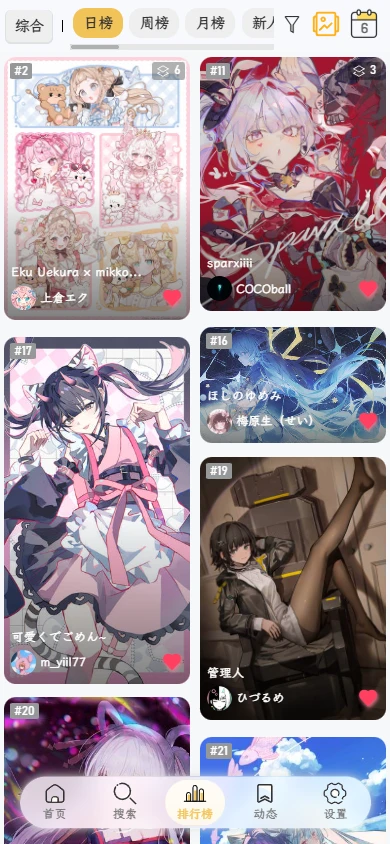</kbd>

<kbd></kbd>  <kbd>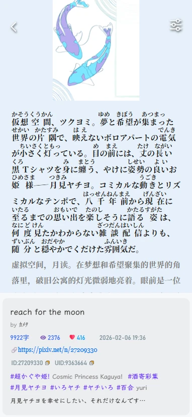</kbd>

<details>
<summary>查看更多</summary>
<kbd>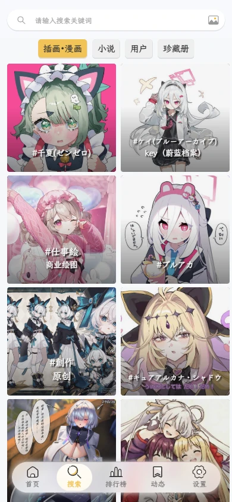</kbd>  <kbd>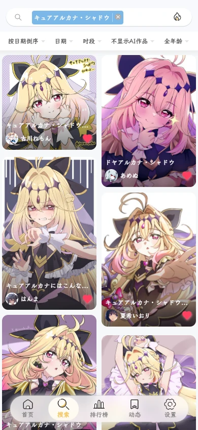</kbd>

<kbd>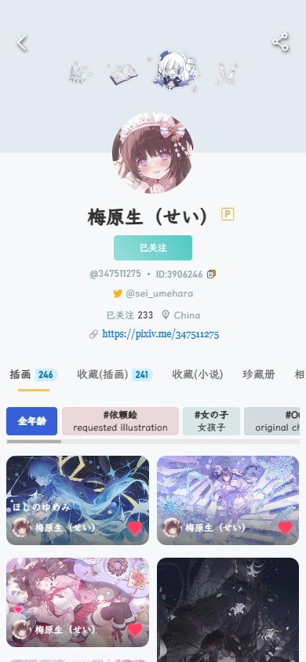</kbd>  <kbd>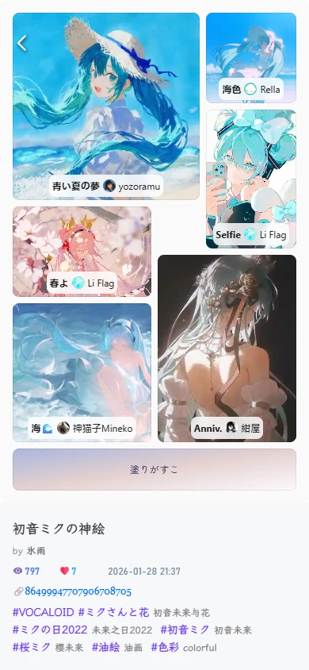</kbd>
</details>
<br>

- 桌面端

<kbd>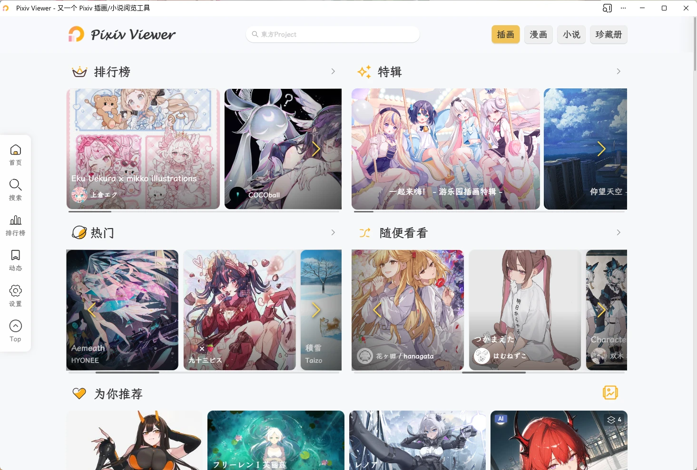</kbd>  <kbd>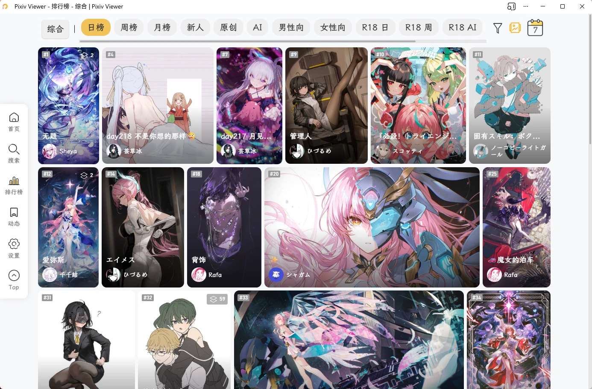</kbd>

<kbd>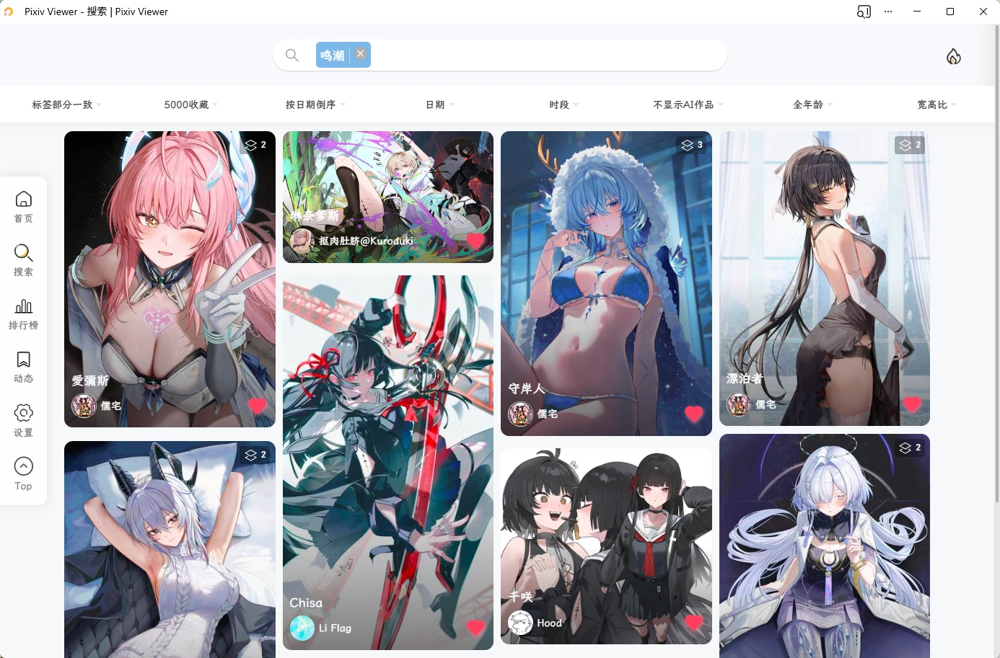</kbd>  <kbd>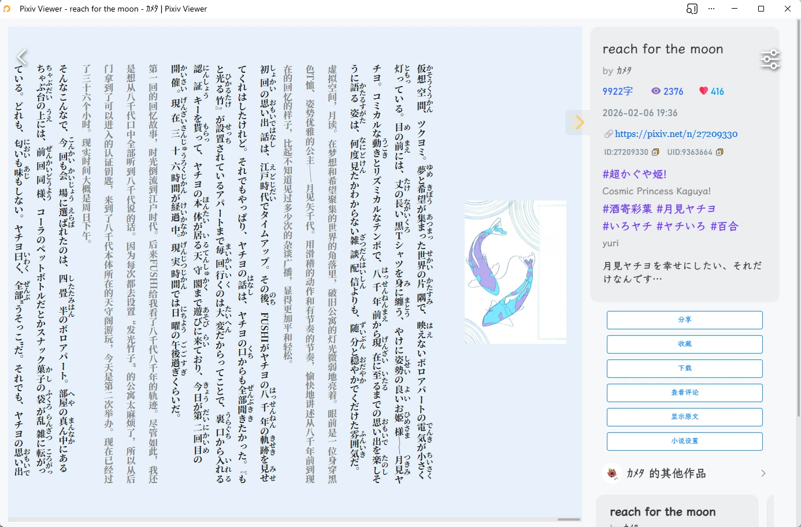</kbd>

<details>
<summary>查看更多</summary>
<kbd>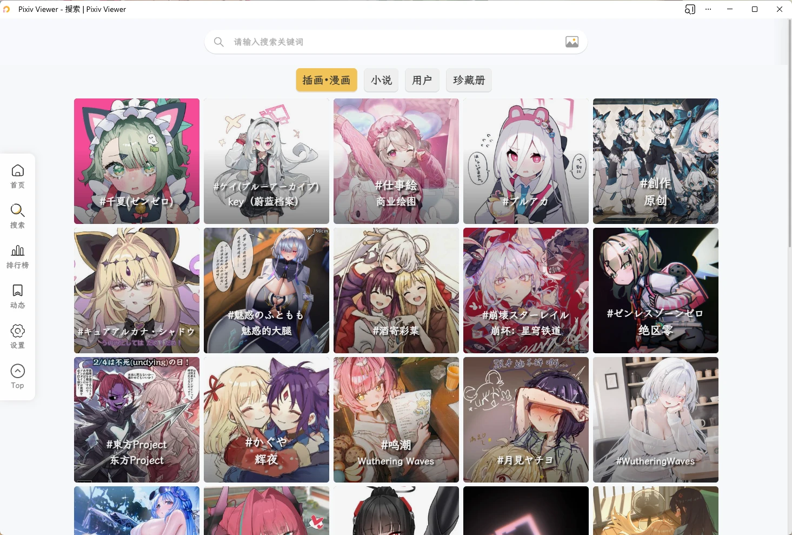</kbd>  <kbd>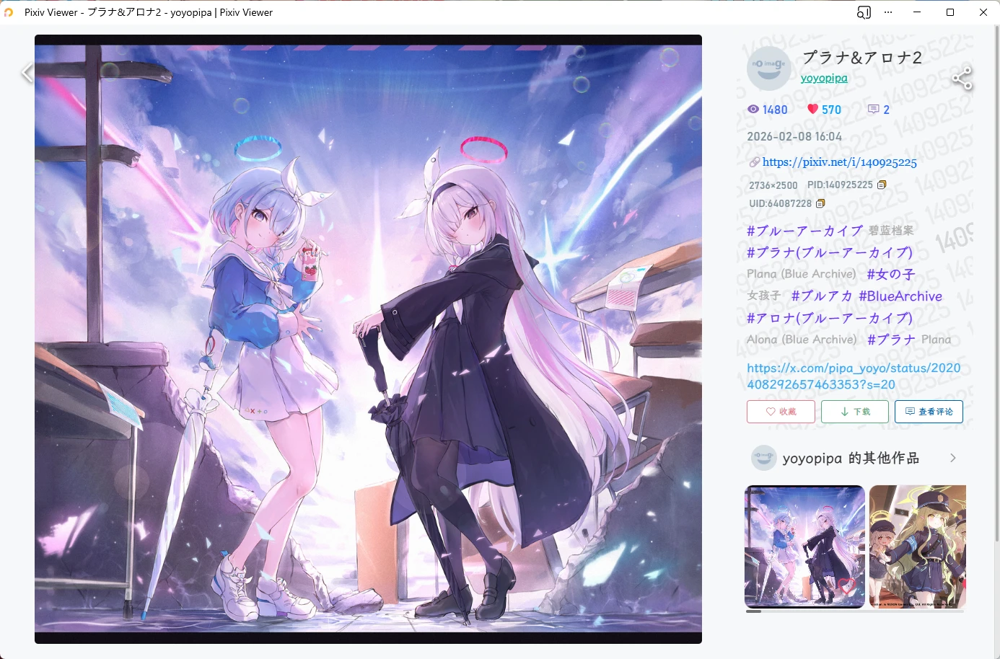</kbd>　

<kbd></kbd>  <kbd>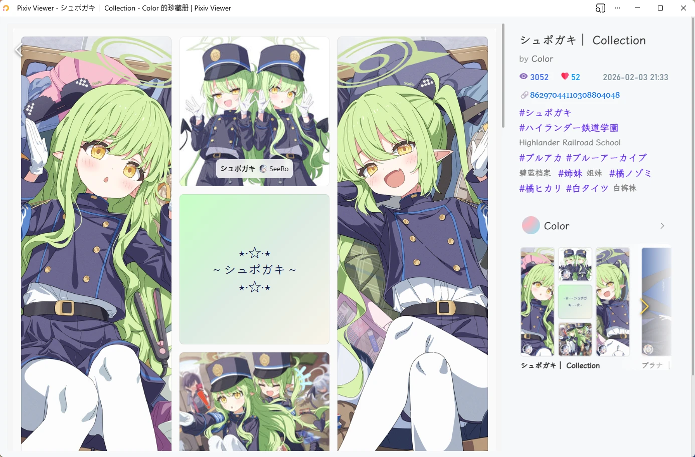</kbd>
</details>

---

## 🚀 技术相关

### 前端架构

- **Vue 2.7**：使用 Vue 2.7 版本，支持 Composition API
- **Vue Router**：单页面应用路由管理，支持路由别名和历史记录
- **Vuex**：集中式状态管理，应用设置持久化
- **Vue I18n**：完整的国际化支持，支持多语言切换

### UI 组件

- **Vant UI**：基于 Vant UI 组件库，提供移动端优先的交互体验
- **Stylus**：CSS 预处理器，支持嵌套和变量
- **响应式设计**：自动适配移动端、平板、桌面端

### PWA 支持

- **Service Worker**：支持离线访问和缓存策略
- **App Shell**：应用外壳架构，提升首屏加载速度
- **安装提示**：支持桌面端和移动端的 PWA 安装
- **应用快捷方式**：支持桌面快捷方式（搜索、排行、动态、设置）

### 性能优化

- **图片懒加载**：移动端默认启用图片懒加载
- **虚拟滚动**：使用虚拟列表技术支持大量数据的高性能渲染
- **路由过渡动画**：使用 View Transitions API 实现流畅的页面切换
- **代码分割**：按需加载部分应用库，减少加载体积

### 高级特性

- **多种布局引擎**：
  - Masonry（瀑布流布局）
  - Grid（网格布局）
  - Justified（两端对齐布局）
  - VirtualList（虚拟列表）
  - VirtualSlide（虚拟轮播）

- **动图处理**：
  - 使用 gif.js 生成 GIF
  - 使用 ts-whammy 生成 WebM
  - 使用 modern-mp4 生成 MP4
  - 支持动图 ZIP 原文件下载

- **文件系统访问**：
  - 使用 WICG File System Access API
  - 支持直接写入本地目录
  - 支持按作者分类下载

- **网络请求**：
  - Axios 封装 HTTP 客户端
  - 支持请求重试机制
  - 支持多种代理服务切换

- **存储方案**：
  - LocalForage 封装 IndexedDB
  - 支持 LocalStorage 和 SessionStorage

---

## 📦 开发指南

### 环境要求

- Node.js >= 16.x
- pnpm >= 9.x

### 安装依赖

```bash
pnpm install
```

### 开发模式

```bash
pnpm serve
```

应用将在 `http://localhost:8080` 启动，支持热重载。

### 生产构建

```bash
pnpm build
```

构建产物将输出到 `dist` 目录。

### 代码检查

```bash
pnpm lint
```

### 构建分析

```bash
pnpm analyze
```

将生成 Bundle 分析报告，帮助优化包体积。

---

## 部署说明

1. 环境准备：Git、Node.js、pnpm

2. 准备好 PxveAPI/HibiAPI 实例和 pximg 代理，参考：
  - https://github.com/asadahimeka/pxve-api
  - https://github.com/mixmoe/HibiAPI
  - https://pixiv.cat/reverseproxy.html

3. 下载或者 git clone 项目代码到本地目录

4. 进入项目目录，在项目根目录下新建 `.env` 文件，参照 `.env.example` 的格式填入环境变量

```bash
cp .env.example .env
# 编辑 .env 文件，填入必要的配置
# ⚠ 注意不要将 `.env` 文件提交到 Git 仓库
```

5. 在代码里全局搜索 pixiv.pictures 替换为你自己的域名

6. 执行如下命令进行打包，打包完的文件在 `dist` 目录里，可自行部署到服务器

```bash
pnpm install
pnpm build
```

---

## 💖 赞助支持

如果这个项目对你有帮助，欢迎请我[喝杯咖啡](https://sponsors-yumine.netlify.app)：

[](https://ko-fi.com/sakurayumine)

您的支持是我持续更新的动力！

---

## ❓ 常见问题

### 如何获取 RefreshToken？

参考教程：https://www.nanoka.top/posts/e78ef86/

### 提示 API 超限或 Rate Limit

- 在设置中切换其他 API 实例
- 使用 RefreshToken 或 OAuth 方式登录

### 图片加载很慢

- 在设置中切换其他图床
- 启用 pximg 图片直连模式（需要良好的网络环境）
- 下载客户端版本使用

### 使用美国/英国 IP 无法查看某些作品

参考 Pixiv 官方公告：https://www.pixiv.net/info.php?id=10837

建议：
1. 使用自己的账号登录
2. 在 Pixiv 官方网页端里[设置](https://www.pixiv.net/setting_user.php)地区为非美国/英国地区（建议选择日区）

### Cookie/SessionID 登录出错

建议使用 RefreshToken 方式登录，更加稳定可靠。

### 列表与详情图片不匹配或重复、搜索结果与搜索标签不匹配

这是自建 API 的 CDN 缓存导致的，解决方案：
- 切换其他 API 实例
- 登录后使用

### 提示“尚无此页”或“尚无权限浏览该作品”或“您的访问权限被限制了”

通常表示该作品已被作者删除或隐藏。

### Android 版本点击下载就闪退

- 在系统设置中授予应用存储权限
- 下载最新版本后再尝试

### 如何安装 iOS 版本？

可到 [Github Releases](https://github.com/asadahimeka/pixiv-viewer/releases) 下载

注意 iOS 版本未签名，需要自行签名侧载安装：

- [爱思助手（视频教程）](https://www.bilibili.com/video/BV1Jg4y1n7hi/)
- [爱思助手](https://www.i4.cn/news_detail_38195.html)
- [AltStore](https://kerrinz.com/archives/432.html)

### 自建部署如何预设图床与 API 实例？

参照 `.env.example` 里的注释或参考讨论：

- [#10](https://github.com/asadahimeka/pixiv-viewer/discussions/10)
- [#13](https://github.com/asadahimeka/pixiv-viewer/discussions/13)

---

## 🤝 贡献指南

欢迎贡献代码、翻译或提出建议！

### 翻译

本项目使用 [Vue I18n](https://kazupon.github.io/vue-i18n/) 进行国际化。

非中文语言翻译主要来自机器翻译，如有不妥，欢迎贡献翻译。

翻译文件位于 `src/locales/` 目录。

### 代码贡献

1. Fork 本仓库
2. 创建特性分支 (`git checkout -b feature/AmazingFeature`)
3. 提交更改 (`git commit -m 'Add some AmazingFeature'`)
4. 推送到分支 (`git push origin feature/AmazingFeature`)
5. 开启 Pull Request

### 报告问题

请使用 [GitHub Issues](https://github.com/asadahimeka/pixiv-viewer/issues) 报告 bug 或提出功能请求。

---

## 🏆 致谢

### 特别感谢

- [journey-ad/pixiv-viewer](https://github.com/journey-ad/pixiv-viewer)：原项目，修改于此

### 贡献者

- [@Blueberryy](https://github.com/Blueberryy)：俄语翻译
- [@olivertzeng](https://github.com/olivertzeng)：繁体中文翻译
- [@kidonng](https://github.com/kidonng)

### 相关项目

- [HibiAPI](https://github.com/mixmoe/HibiAPI)：提供大部分接口支持
- [PxveAPI](https://github.com/asadahimeka/pxve-api)：HibiAPI 兼容以及其他接口服务
- [PixivNow](https://github.com/FreeNowOrg/PixivNow)：提供部分网页版接口支持

### 服务

- [Pixiv.cat](https://pixiv.re/)：图像反代服务
- [SauceNAO](https://saucenao.com/)：以图搜图功能接口
- [Cloudflare Workers](https://workers.cloudflare.com/)：图像反代服务
- [Cloudflare Pages](https://pages.cloudflare.com/)：提供页面托管服务

### 技术栈

- [Vue](https://vuejs.org/)：前端框架
- [Vant UI](https://vant-ui.github.io/vant/v2/#/zh-CN/)：UI 组件库
- [Vue I18n](https://kazupon.github.io/vue-i18n/)：国际化支持

---

## 🔗 相关站点

- [Pixivel](https://pxelk.cocomi.eu.org/)
- [Pixiviz](https://pixiviz.cocomi.eu.org/)
- [PixivNow](https://pxnow.cocomi.eu.org/)
- [PixivMoe](https://pixivmoe.cocomi.eu.org/)
- [PixivLxns](https://pixivlxns.cocomi.eu.org/)
- [MixPiv](https://mixpiv.cocomi.eu.org/)
- [PixiviFE](https://pixiv.perennialte.ch/)
- [pixivic](https://pixivic.com)
- [vilipix](https://www.vilipix.com/ranking)
- [moeview](https://moeview.cocomi.eu.org/)
- [booruwf](https://booru.cocomi.eu.org/)
- [PixivRanking](https://www.nanoka.top/illust/pixiv/)

---

## 📜 免责声明

本项目与 pixiv.net（ピクシブ株式会社）无任何隶属关系。

本项目网站、APP 所展示的所有作品的版权均为 Pixiv 或其原作者所有。

本项目仅供交流与学习，不得用于任何商业用途。

---

## 📄 许可证

本项目基于 [MIT License](LICENSE) 开源。

---

<br>

**如果这个项目对你有帮助，请给一个 ⭐️ Star 支持一下！**

Made with ❤️ by Sakura Yumine
