<p align="center"></p>

<h1 align="center">Pixiv Viewer <sup><small>Kai</small></sup></h1>
<p align="center">Yet Another Pixiv Illust & Novel Viewer.</p>
<p align="center">Port of <a href="https://github.com/journey-ad/pixiv-viewer">journey-ad/pixiv-viewer</a></p>

<p align="center">


</p>

<p align="center">


</p>

English | [中文](../README.md)

Yet another Pixiv viewer, providing online browsing of Pixiv illustrations, animations, manga, and novels. It supports multi-platform layouts, offers multiple browsing layout options, supports PWA installation, allows custom APIs and image hosting services, and supports login via RefreshToken, OAuth, or Cookie.

Preview: 🔗 [pixiv.pictures](https://pixiv.pictures)

Download: ⏬ [GitHub Releases](https://github.com/asadahimeka/pixiv-viewer/releases)

---

## 📖 Table of Contents

* [Features](#-features)
* [Screenshots](#-screenshots)
* [Technical Details](#-technical-details)
* [Development Guide](#-development-guide)
* [Deployment](#deployment)
* [Sponsorship](#-sponsorship)
* [FAQ](#-faq)
* [Contribution Guide](#-contribution-guide)
* [Acknowledgements](#-acknowledgements)
* [Related Sites](#-related-sites)
* [Disclaimer](#-disclaimer)
* [License](#-license)

---

## ✨ Features

### 🏠 Home

| Feature | Description |
| --- | --- |
| Multiple Content Types | Illustrations, manga, novels, bookmarks, and more |
| Rankings | View daily popular works |
| Featured Specials | Browse official curated special content |
| Personalized Recommendations | Recommendations based on personal preferences |
| Discover Page | Explore site-wide popular and newly discovered works |
| Random Browse | Randomly browse high-quality works |
| Bookmarks | Centralized display of favorite works |

### 🔍 Search

| Feature | Description |
| --- | --- |
| Comprehensive Search | Illustrations & manga, novels, users, bookmarks |
| Trending Keywords | Current trending search terms (long press for tag cover) |
| Smart Suggestions | Automatic keyword autocomplete |
| Search Filters | Filter by bookmark count, submission time, etc. |
| Popular Preview | Non-member preview of popular works (first 30) |
| Search by Image | Upload images to find similar works |
| Direct ID Navigation | Enter a work/user ID in the search box to jump directly |

### 📊 Rankings

| Feature | Description |
| --- | --- |
| Multi-dimensional Rankings | Overall / illustrations / manga / animations / novels |
| R18 / AI Rankings | Adult content and AI-generated works rankings |
| Historical Rankings | View rankings by date |

### 📱 Activity

| Feature | Description |
| --- | --- |
| Following Updates | New works from followed users |
| My Bookmarks | Bookmarked illustrations and novels |
| Followed Users | Followed user list |
| Recommended Users | Recommended user list |
| Latest Works | Latest uploads site-wide |

### 🖼️ Artwork Page

| Feature | Description |
| --- | --- |
| Illustration Actions | Bookmark, unbookmark, download, comment, share |
| Source Link | Quick access to the Pixiv source page |
| ID Copy | One-click copy of artwork / author ID |
| Animation Playback | Supports Ugoira playback |

#### Novel Reading

| Feature | Description |
| --- | --- |
| Novel Download | TXT / HTML / Markdown / DOC / PDF / EPUB |
| Reading Settings | Customize fonts, colors, reading direction, etc. |
| Rich Text Rendering | Novel rich text formatting |
| Reading Progress Memory | Auto-saves scroll position for continued reading |
| Native Reader | Immersive WebView reading experience |
| Novel Translation | Integrated online translation |

#### Manga Translation

| Feature | Description |
| --- | --- |
| One-Click Translation | Built-in translation engine, no external services required |
| Local Inference | Detection / OCR / inpainting via ONNX Runtime Web, all in-browser |
| Typesetting Engine | Horizontal / vertical text layout, bubble & reading order matching |
| Multiple Model Providers | SiliconCloud and other LLM providers |
| Original / Translated Toggle | One-click comparison of results |

### 👤 Author Page

| Feature | Description |
| --- | --- |
| Follow Management | Follow / unfollow authors |
| Works Browsing | Illustrations, manga, bookmarks, novels, collections |
| Series View | Manga and novel series |
| Tag Browsing | Author's commonly used illustration tags |
| Related Users | Discover similar authors |
| Twitter Media | Images / videos posted on X (Twitter) |

### ⚙️ Settings

#### Login Methods

| Feature | Description |
| --- | --- |
| RefreshToken Login | Log in directly using Pixiv RefreshToken |
| OAuth Login | Log in via Pixiv OAuth authorization |
| Cookie Login | Cookie-based login (not recommended) |

#### Content Control

| Feature | Description |
| --- | --- |
| R18 Toggle | Control adult content display |
| AI Works Toggle | Control AI-generated works display |
| Local Blacklist | Block tags / users, tag-based UI, individually removable |

#### Browsing Experience

| Feature | Description |
| --- | --- |
| Multi-language Support | Simplified / Traditional Chinese, English, Russian, etc. |
| Dark Mode | Eye-friendly night mode |
| Custom Theme Color | Customize app theme color |
| Image Feed Layouts | Masonry, grid, virtual list, etc. |
| Image Quality Selection | Medium / Large / Large (WebP), etc. |
| Swipe Navigation | Swipe left / right on detail pages |
| Page Transitions | Multiple page transition animations |

#### Network & Data

| Feature | Description |
| --- | --- |
| Multiple Image Proxies | Switch between image proxy services |
| Multiple API Instances | Switch between backend API instances |
| AppAPI Proxy Mode | Direct Pixiv App API connection (self-hosted proxy required) |
| pximg Direct Access | Direct access to Pixiv image servers |
| IndexedDB Cache | Local caching for faster loading |
| History | Browsing history |
| Clear Cache | One-click cache clearing |

#### Download Features

| Feature | Description |
| --- | --- |
| Long Press Download | Long press list images to download |
| Long Press Block | Long press to quickly block users |
| File System Access API | Modern browser File System Access API |
| Tampermonkey Support | Download via Tampermonkey scripts |
| Custom Filename Format | Custom download filename templates |
| Animated Export Formats | ZIP / GIF / WebM / APNG / MP4 / AVIF |

#### Backup & Restore

| Feature | Description |
| --- | --- |
| Settings Backup | Backup / restore app settings |
| History Backup | Backup / restore browsing history |
| Cloud Sync | PBKDF2 + AES encryption, conflict detection & smart merge |
| Export RefreshToken | For use in other applications |

#### Client Support

| Platform | Support |
| --- | --- |
| PWA Installation | ✅ |
| Android / Windows | ✅ |
| iOS / macOS | ✅ |

---

## 📸 Screenshots

* Mobile

<kbd>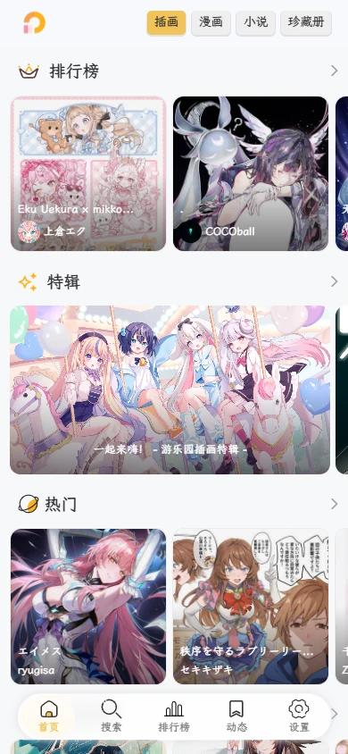</kbd>  <kbd>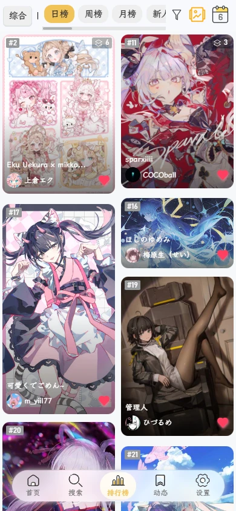</kbd>

<kbd>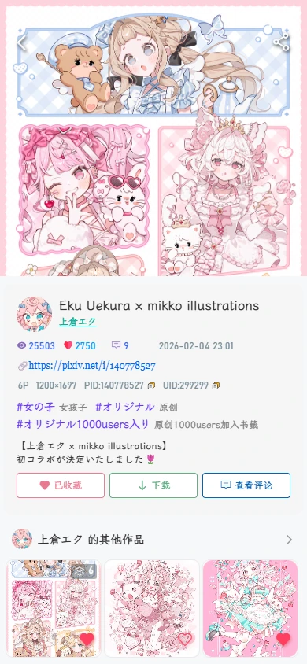</kbd>  <kbd>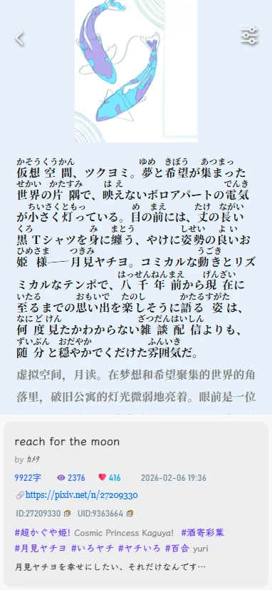</kbd>

<details>
<summary>View More</summary>
<kbd>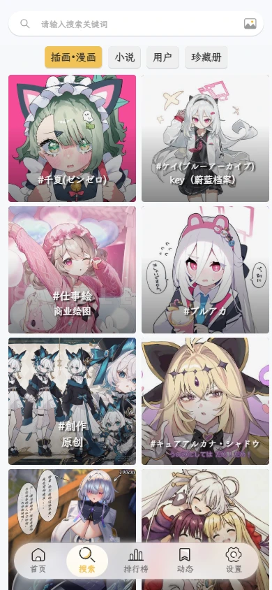</kbd>  <kbd>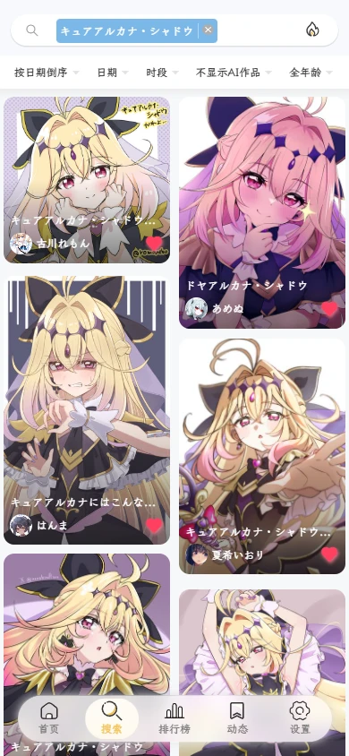</kbd>

<kbd>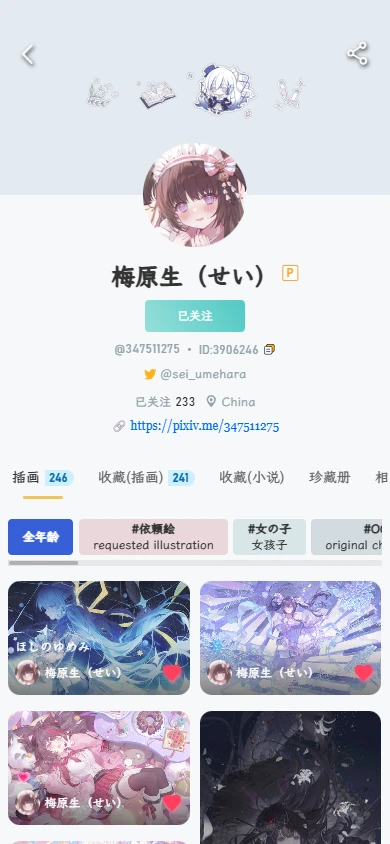</kbd>  <kbd>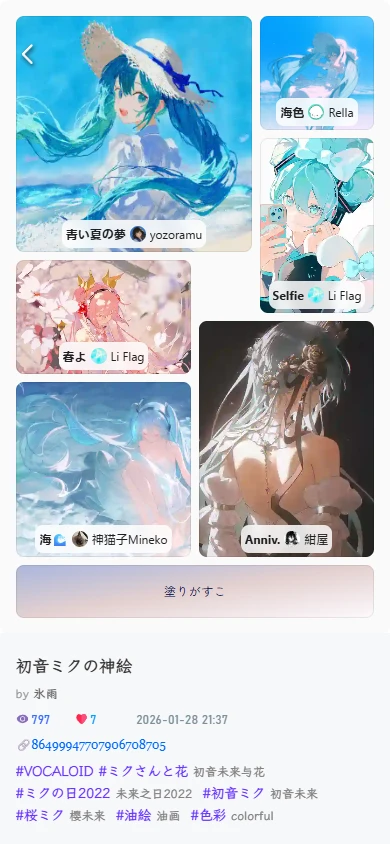</kbd>

</details>
<br>

* Desktop

<kbd>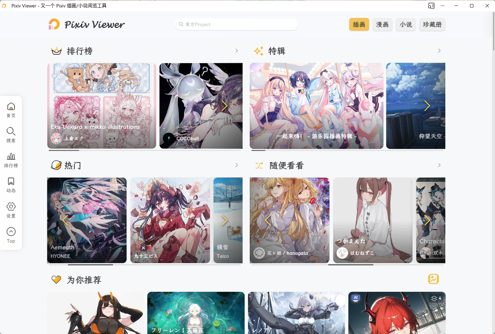</kbd>  <kbd>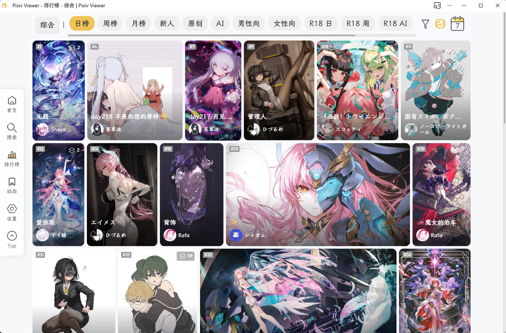</kbd>

<kbd>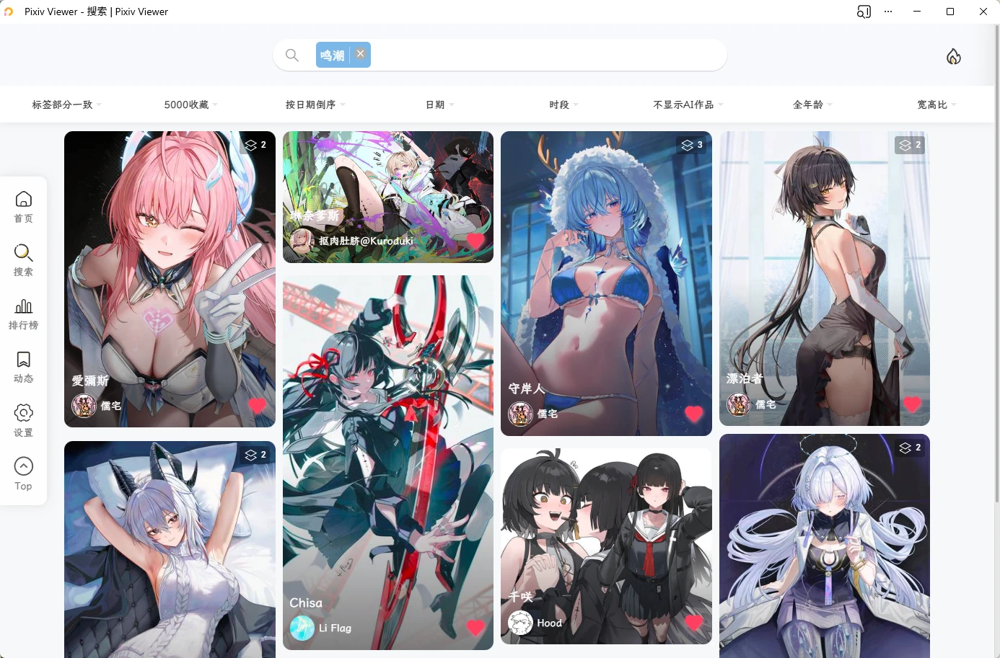</kbd>  <kbd>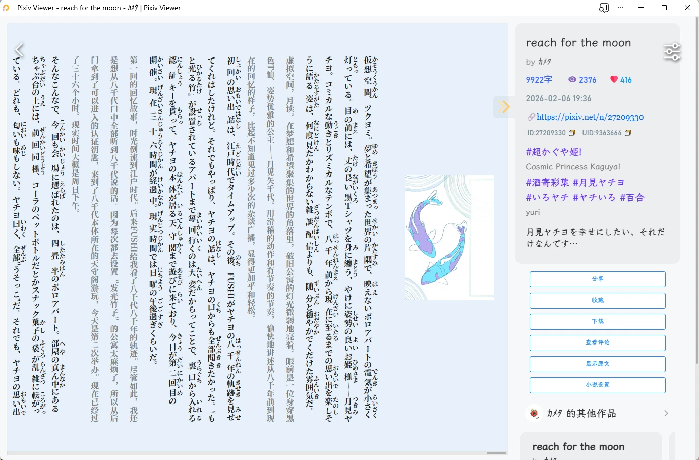</kbd>

<details>
<summary>View More</summary>
<kbd>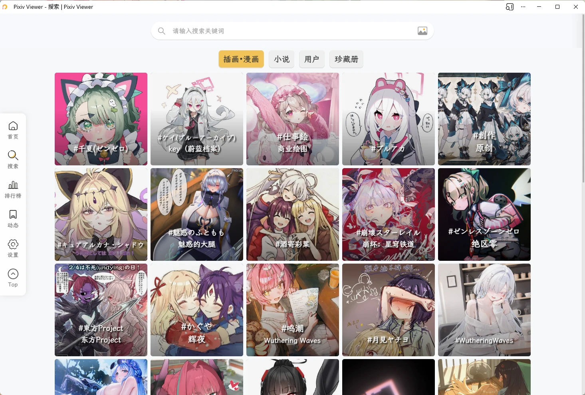</kbd>  <kbd>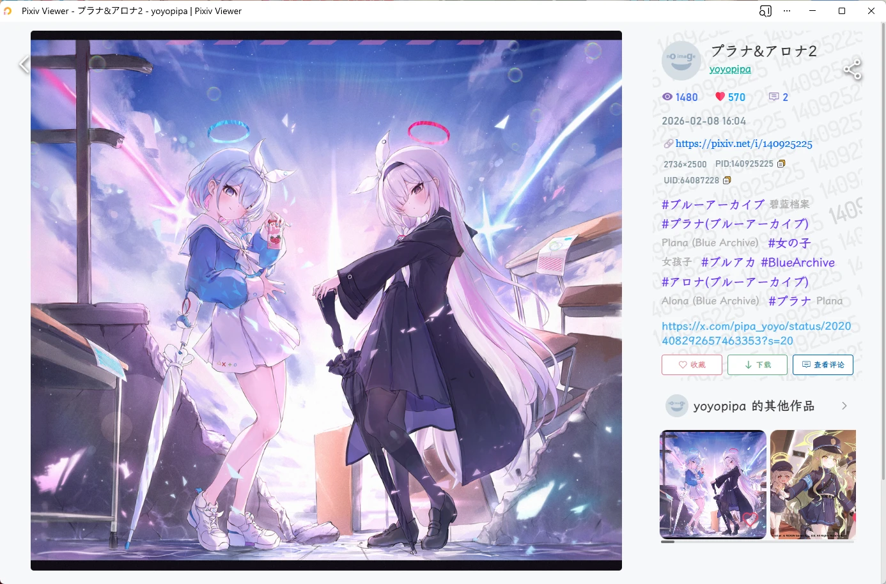</kbd>　

<kbd>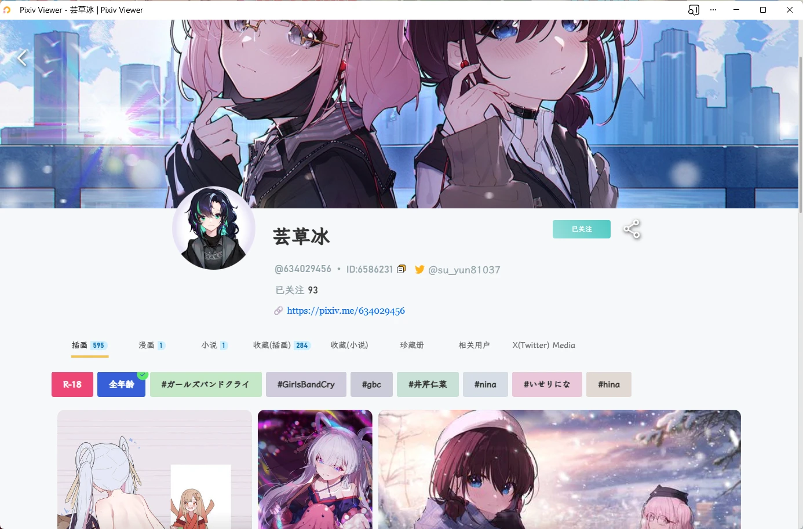</kbd>  <kbd>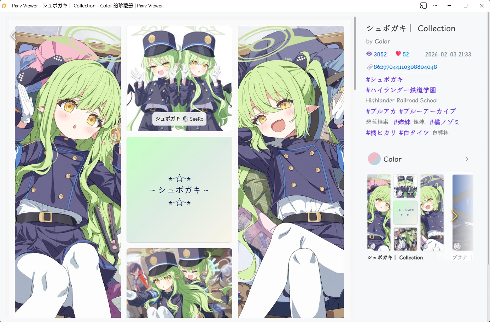</kbd>

</details>

---

## 🚀 Technical Details

### Frontend Architecture

* **Vue 2.7**: Uses Vue 2.7 with Composition API support
* **Vue Router**: SPA routing with alias and history support
* **Vuex**: Centralized state management with persistent settings
* **Vue I18n**: Full internationalization support with language switching

### UI Components

* **Vant UI**: Mobile-first UI component library based on Vant
* **Stylus**: CSS preprocessor with nesting and variables
* **Responsive Design**: Automatically adapts to mobile, tablet, and desktop

### PWA Support

* **Service Worker**: Offline access and caching strategies
* **App Shell**: App shell architecture for faster initial load
* **Install Prompts**: PWA installation on desktop and mobile
* **App Shortcuts**: Desktop shortcuts (search, rankings, activity, settings)

### Performance Optimization

* **Image Lazy Loading**: Enabled by default on mobile
* **Virtual Scrolling**: High-performance rendering for large data sets
* **Route Transitions**: Smooth page transitions using the View Transitions API
* **Code Splitting**: Load libraries on demand to reduce bundle size

### Advanced Features

* **Multiple Layout Engines**:

  * Masonry
  * Grid
  * Justified
  * VirtualList
  * VirtualSlide

* **Animation Processing**:

  * Generate GIF with gif.js
  * Generate WebM with ts-whammy
  * Generate MP4 with modern-mp4
  * Support original ZIP download for animations

* **File System Access**:

  * Uses WICG File System Access API
  * Supports direct writing to local directories
  * Supports downloads organized by author

* **Network Requests**:

  * Axios-wrapped HTTP client
  * Request retry mechanism
  * Multiple proxy service switching

* **Storage Solutions**:

  * IndexedDB via LocalForage
  * Supports LocalStorage and SessionStorage

* **Manga Translation Engine**:

  * ONNX Runtime Web (WebGPU/WASM) local inference
  * Worker thread inference (Comlink), non-blocking to the main thread
  * Text detection + PaddleOCR recognition + image inpainting pipeline
  * Multi-provider LLM translation (SiliconCloud / DeepSeek / OpenAI, etc.)
  * Canvas horizontal/vertical text typesetting

* **Cloud Sync**:

  * PBKDF2 key derivation + AES encryption
  * Dual-input auth and scope selection
  * Conflict detection (409) and smart merge

---

## 📦 Development Guide

### Requirements

* Node.js >= 16.x
* pnpm >= 9.x

### Install Dependencies

```bash
pnpm install
```

### Development Mode

```bash
pnpm serve
```

The application will start at `http://localhost:8080` with hot reload enabled.

### Production Build

```bash
pnpm build
```

Build artifacts will be output to the `dist` directory.

### Linting

```bash
pnpm lint
```

### Bundle Analysis

```bash
pnpm analyze
```

Generates a bundle analysis report to help optimize bundle size.

---

## Deployment

1. Prepare environment: Git, Node.js, pnpm

2. Prepare PxveAPI / HibiAPI instances and pximg proxy, refer to:

  * [https://github.com/asadahimeka/pxve-api](https://github.com/asadahimeka/pxve-api)
  * [https://github.com/mixmoe/HibiAPI](https://github.com/mixmoe/HibiAPI)
  * [https://pixiv.cat/reverseproxy.html](https://pixiv.cat/reverseproxy.html)

3. Download or git clone the project source code to a local directory

4. Enter the project directory and create a `.env` file in the root directory, filling in environment variables according to `.env.example`

```bash
cp .env.example .env
# Edit the .env file and fill in the required configuration
# ⚠ Do not commit the `.env` file to the Git repository
```

5. Run the following commands to build the project. The built files will be in the `dist` directory and can be deployed to your server

```bash
pnpm install
pnpm build
```

---

## 💖 Sponsorship

If this project helps you, feel free to [buy me a coffee](https://sponsors-yumine.netlify.app):

[](https://ko-fi.com/sakurayumine)

Your support is the motivation for continuous updates!

---

## ❓ FAQ

### How to obtain a RefreshToken?

Refer to the tutorial: [https://www.nanoka.top/posts/e78ef86/](https://www.nanoka.top/posts/e78ef86/)

### API quota exceeded or rate limited

* Switch to another API instance in settings
* Log in using RefreshToken or OAuth

### Images load very slowly

* Switch to another image proxy in settings
* Enable pximg direct access mode (requires a good network environment)
* Download and use the client version

### Some works are not accessible with US/UK IPs

Refer to Pixiv official announcement: [https://www.pixiv.net/info.php?id=10837](https://www.pixiv.net/info.php?id=10837)

Recommendations:

1. Log in with your own account
2. Set your region to a non-US/UK region in Pixiv web [settings](https://www.pixiv.net/setting_user.php) (Japan recommended)

### Cookie / SessionID login errors

It is recommended to use RefreshToken login, which is more stable and reliable.

### Mismatched or duplicated images in lists and details, or search results do not match search tags

This is caused by CDN caching of self-hosted APIs. Solutions:

* Switch to another API instance
* Use after logging in

### “Page not found”, “No permission to view this work”, or “Your access has been restricted”

This usually means the work has been deleted or hidden by the author.

### Android version crashes when clicking download

* Grant storage permissions in system settings
* Update to the latest version and try again

### How to install the iOS version?

Download from [GitHub Releases](https://github.com/asadahimeka/pixiv-viewer/releases)

Note: The iOS version is unsigned and requires manual signing and sideloading:

* [AltStore](https://altstore.io/)

### How to preset image proxies and API instances for self-hosted deployment?

Refer to discussions:

* [#10](https://github.com/asadahimeka/pixiv-viewer/discussions/10)
* [#13](https://github.com/asadahimeka/pixiv-viewer/discussions/13)

---

## 🤝 Contribution Guide

Contributions of code, translations, or suggestions are welcome!

### Translation

This project uses [Vue I18n](https://kazupon.github.io/vue-i18n/) for internationalization.

Most non-Chinese translations are machine-generated. Contributions are welcome if there are inaccuracies.

Translation files are located in the `src/locales/` directory.

### Code Contribution

1. Fork this repository
2. Create a feature branch (`git checkout -b feature/AmazingFeature`)
3. Commit changes (`git commit -m 'Add some AmazingFeature'`)
4. Push to the branch (`git push origin feature/AmazingFeature`)
5. Open a Pull Request

### Reporting Issues

Please use [GitHub Issues](https://github.com/asadahimeka/pixiv-viewer/issues) to report bugs or request features.

---

## 🏆 Acknowledgements

### Special Thanks

* [journey-ad/pixiv-viewer](https://github.com/journey-ad/pixiv-viewer): Original project, modified from this

### Contributors

* [@Blueberryy](https://github.com/Blueberryy): Russian translation
* [@olivertzeng](https://github.com/olivertzeng): Traditional Chinese translation
* [@kidonng](https://github.com/kidonng)

### Related Projects

* [HibiAPI](https://github.com/mixmoe/HibiAPI): Provides most API support
* [PixivNow](https://github.com/FreeNowOrg/PixivNow): Provides partial Web API support.
* [pxder](https://github.com/Tsuk1ko/pxder): OAuth login reference.
* [PixEz](https://github.com/Notsfsssf/pixez-flutter): Direct connect mode logic reference.
* [ShinobuTranslator](https://github.com/DonutShinobu/ShinobuTranslator): Manga translation engine.
* [KISS Translator](https://github.com/fishjar/kiss-translator): Translation tool.
* [ZeoSeven Fonts](https://fonts.zeoseven.com): Free fonts for everyone!

### Services

- [Yuki 妙妙屋](https://yuki.sh/): Image proxy service
* [Pixiv.cat](https://pixiv.re/): Image proxy service
* [SauceNAO](https://saucenao.com/): Image search API
* [Cloudflare Workers](https://workers.cloudflare.com/): Image proxy service
* [Cloudflare Pages](https://pages.cloudflare.com/): Page hosting service

### Tech Stack

* [Vue](https://vuejs.org/): Frontend framework
* [Vant UI](https://vant-ui.github.io/vant/v2/#/zh-CN/): UI component library
* [Vue I18n](https://kazupon.github.io/vue-i18n/): Internationalization support

---

## 🔗 Related Sites

- [Pixivel](https://pxelk.cocomi.eu.org/)
- [Pixiviz](https://pixiviz.cocomi.eu.org/)
- [PixivNow](https://pxnow.cocomi.eu.org/)
- [PixivFun](https://pxfun.cocomi.eu.org/)
- [PixivMoe](https://pixivmoe.cocomi.eu.org/)
- [PixivLxns](https://pixivlxns.cocomi.eu.org/)
- [MixPiv](https://mixpiv.cocomi.eu.org/)
- [PixivFE](https://pixiv.perennialte.ch/)
- [pixivic](https://pixivic.com)
- [moeview](https://moeview.cocomi.eu.org/)
- [booruwf](https://booru.cocomi.eu.org/)
- [Ranking](https://www.nanoka.top/illust/pixiv/)

---

## 📜 Disclaimer

This project is not affiliated with pixiv.net (ピクシブ株式会社) in any way.

All works displayed on this website and app are copyrighted by Pixiv or their original authors.

This project is for communication and learning purposes only and must not be used for any commercial purposes.

---

## 📄 License

This project is open-sourced under the [AGPL-3.0 License](LICENSE).

Copyright © 2020 Jad

Copyright © 2022 Sakura Yumine

---

**If this project helps you, please give it a ⭐️ Star to show your support!**

Made with ❤️ by Sakura Yumine
